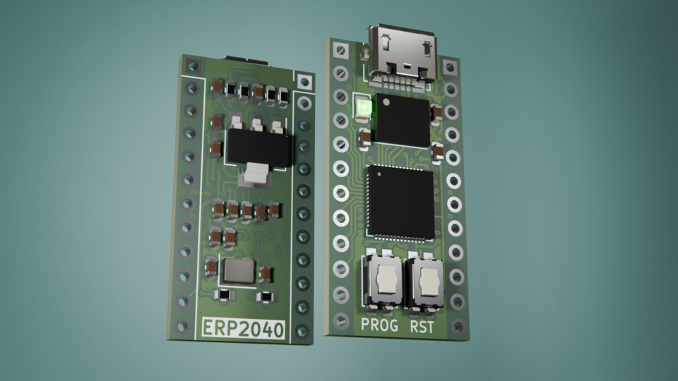
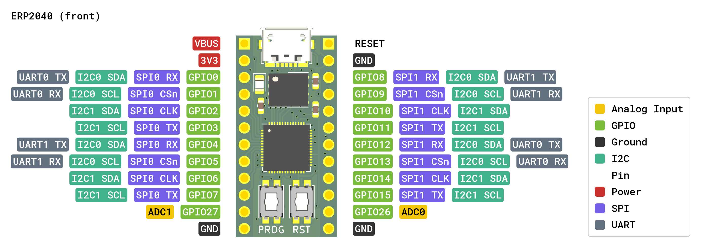
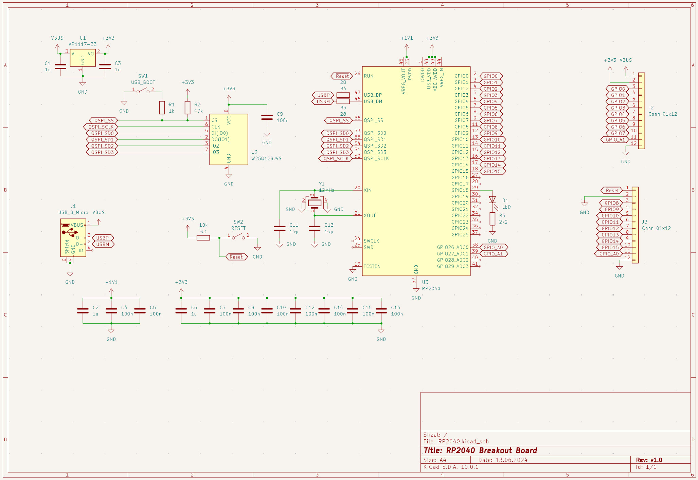
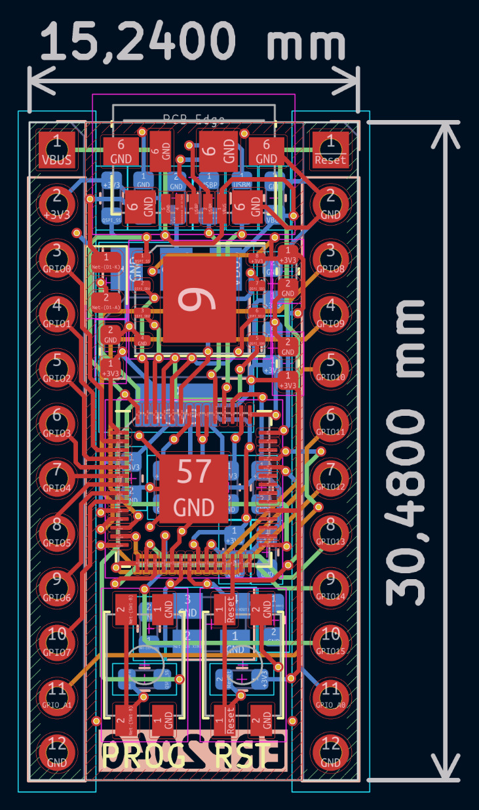

# RP2040 Breakout Board

Minimal RP2040 breakout with USB Micro-B, 16 MB QSPI flash, and full GPIO headers in a breadboard-friendly form factor.



---

## Pin Reference



---

## Specifications

| Parameter | Value |
|-----------|-------|
| MCU | RP2040 (dual-core Arm Cortex-M0+ @ up to 133 MHz) |
| Flash | 16 MB W25Q128JVS (QSPI) or compatible |
| Supply voltage | 5 V via USB Micro-B; 3.3 V via onboard AP1117-33 LDO |
| Internal 1.1 V rail | Generated by RP2040 internal LDO (VREG) |
| Clock | 12 MHz external crystal |
| USB | USB Micro-B (power + data) |
| GPIO headers | 2 × 12-pin 2.54 mm (J2, J3) |
| Status | Tested - fully functional |

---

## Schematic and PCB

| Schematic                        | Board                    |
|:--------------------------------:|:------------------------:|
|  |  |

---

## Boot & Reset

| Control | Component | Behaviour |
|---------|-----------|-----------|
| **BOOT** | SW1 (USB_BOOT) | Hold while connecting USB to enter USB bootloader (UF2 mode). Pulls QSPI_SS low via R1 (1 kΩ); R2 (47 kΩ) pulls QSPI_SS high normally. |
| **RESET** | SW2 (RESET) | Momentarily pulls RUN low. R3 (10 kΩ) holds RUN high during normal operation. |

---

## Manufacturing

Gerber files are in the [`gerber/`](gerber/) directory, ready to upload to JLCPCB, PCBWay, or equivalent.

Suggested fab settings:

| Setting | Value |
|---------|-------|
| Layers | 4 (F_Cu, In1_Cu, In2_Cu, B_Cu) |
| Thickness | 1.6 mm |
| Surface finish | HASL (lead-free) or ENIG |

---

## Status

- [x] Designed, not yet ordered
- [x] Ordered — awaiting boards
- [x] Assembled, untested
- [x] Tested and working

---

## Building / Programming

### USB Bootloader (UF2)

```bash
# 1. Hold SW1 (BOOT button) and connect USB — board appears as RPI-RP2 mass storage
# 2. Drag and drop a UF2 firmware image
cp firmware.uf2 /media/$USER/RPI-RP2
```

---

## License

Licensed under the MIT [License](LICENSE)
